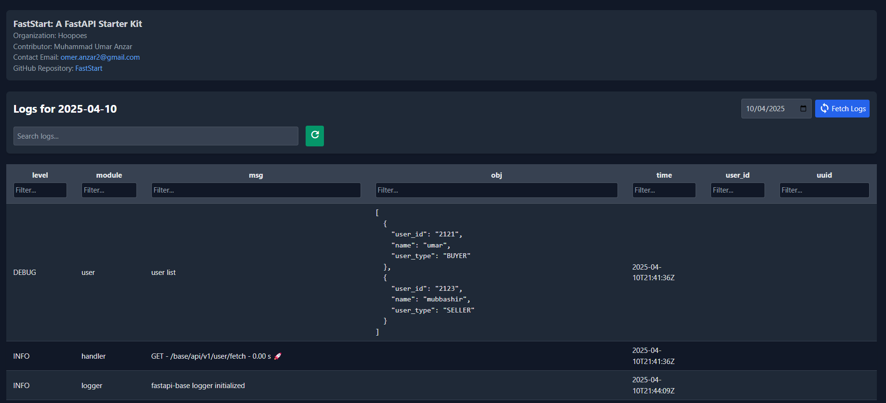

<p align="center" width="100%">
  
</p>


# FastStart: A FastAPI Starter Kit
[](https://github.com/Hoopoes/FastStart/blob/main/LICENSE)
[](https://github.com/Hoopoes/FastStart/stargazers)
[](https://github.com/Hoopoes/FastStart/network/members)
[](https://github.com/Hoopoes/FastStart/issues)
[](https://github.com/Hoopoes/FastStart/pulls)
[](https://github.com/Hoopoes/FastStart/graphs/contributors)


**FastStart** is a modular and flexible starting point for building backend microservices with FastAPI. This repository provides a robust base structure with various extensions and configurations to help you get started quickly and efficiently.

## ✨ Features

- **Multiple Variations**: Branches with various features and integrations, such as:
- **Extensible**: Easily add and customize features as per your project requirements.
- **Best Practices**: Follow industry best practices for code organization, security, and performance.

## 🌱 Branches

| Branch Name                                                        | Description                                                                    |
|--------------------------------------------------------------------|--------------------------------------------------------------------------------|
| [minimal](https://github.com/Hoopoes/FastStart/tree/minimal)       | A lightweight, stripped-down FastAPI starter with only essential boilerplate.     |
| [base](https://github.com/Hoopoes/FastStart/tree/base)             | A well-organized and scalable FastAPI project structure with integrated features to kickstart your development. |
| [sqlalchemy](https://github.com/Hoopoes/FastStart/tree/sqlalchemy) | A base structure with Async SQLAlchemy integrated, extending the core functionality. |
| [log-viewer](https://github.com/Hoopoes/FastStart/tree/log-viewer) | A base structure with an integrated log viewer for inspecting application logs |

## 🚀Getting Started

To get started with the FastAPI Starter Kit, clone the repository using the following command:

Example:
```bash
git clone --single-branch -b <BRANCH_NAME> https://github.com/Hoopoes/FastStart.git
```

```bash
git clone --single-branch -b minimal https://github.com/Hoopoes/FastStart.git
```

## 📂 Log Viewer

**FastStart** also includes a [**Log Viewer**](https://github.com/Hoopoes/FastStart/tree/log-viewer) for easy access to logs and error tracking.



To access the Log Viewer, simply navigate to the appropriate route in the application (you may need to configure the path depending on your setup). This feature helps you monitor the logs and debug your application more effectively.

## 🌟 Star History

[](https://star-history.com/#Hoopoes/FastStart&Timeline)

## 📞 Contact

For any questions or feedback, please reach out to:
- Muhammad Umar Anzar - omer.anzar2@gmail.com
- Mubashir Ahmed Siddiqui - mubashirsidiki@gmail.com

Or open an issue on GitHub.
