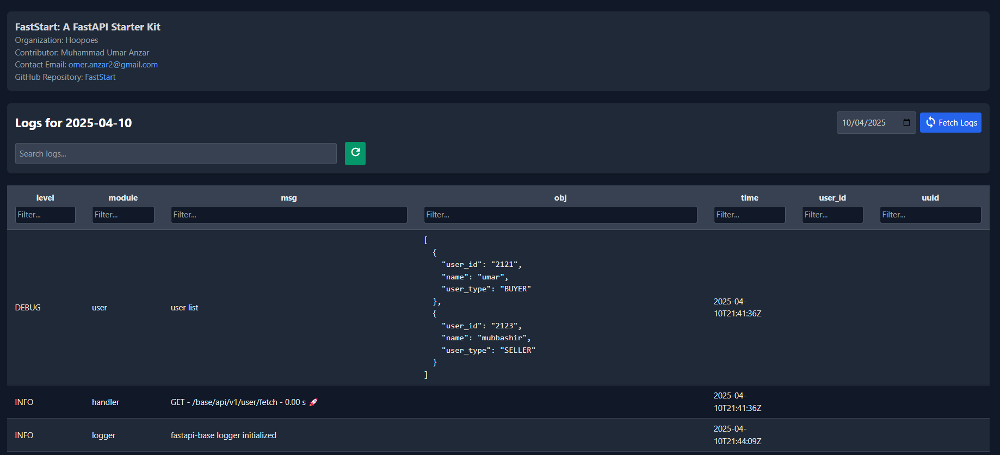

<p align="center" width="100%">
  
</p>

# FastStart: A FastAPI Starter Kit
[](https://github.com/Hoopoes/FastStart/blob/main/LICENSE)
[](https://github.com/Hoopoes/FastStart/stargazers)
[](https://github.com/Hoopoes/FastStart/network/members)
[](https://github.com/Hoopoes/FastStart/issues)
[](https://github.com/Hoopoes/FastStart/pulls)
[](https://github.com/Hoopoes/FastStart/graphs/contributors)

**FastStart** is a modular and flexible starting point for building backend microservices with FastAPI. This repository provides a robust base structure with various extensions and configurations to help you get started quickly and efficiently.

## ✨ Features

- **Multiple Variations**: Different branches provide various features and integrations (see Branches table below).
- **Extensible**: Easily add and customize features as per your project requirements.
- **Best Practices**: Follow industry best practices for code organization, security, and performance.

## 🌱 Branches

| Branch Name                                                        | Description                                                                    |
|--------------------------------------------------------------------|--------------------------------------------------------------------------------|
| [main](https://github.com/Hoopoes/FastStart)       | A lightweight, stripped-down FastAPI starter with only essential boilerplate.     |
| [base](https://github.com/Hoopoes/FastStart/tree/base)             | Builds on `main` by adding improved OpenAPI documentation, better error handling, and common middleware utilities. |
| [sqlalchemy](https://github.com/Hoopoes/FastStart/tree/sqlalchemy) | Extends `base` with integrated support for Async SQLAlchemy to handle asynchronous database operations efficiently. |
| [log-viewer](https://github.com/Hoopoes/FastStart/tree/log-viewer) | Extends `base` with a built-in log viewer for inspecting application logs directly from the browser. |


## 📁 Branch Structure (`main`)
The `main` branch is a modular and flexible starting point for developing backend microservices with FastAPI.

## 🚀 Getting Started

To get started with the FastAPI Starter Kit, follow the steps:

### Prerequisites

Before setting up this project, you should be familiar with:

- **[uv](https://docs.astral.sh/uv)**: A fast tool for managing Python packages, environments, and project dependencies.

### Setup

1. Clone the Repository

```bash
git clone --single-branch -b main https://github.com/Hoopoes/FastStart.git
cd FastStart
```

2. Install Dependencies

```bash
uv sync
```

3. Run the Application

```bash
uv run python main.py
```

### Project Structure

```
📦Project
 ┣ 📂app
 ┃ ┣ 📂errors
 ┃ ┣ 📂middlewares
 ┃ ┣ 📂models
 ┃ ┣ 📂routes
 ┃ ┃ ┣ 📂v1
 ┃ ┃ ┃ ┣ 📂endpoints
 ┃ ┃ ┃ ┃ ┗ 🐍user.py
 ┃ ┃ ┃ ┗ 🐍v1_route.py
 ┃ ┃ ┗ 🐍route.py
 ┃ ┣ 📂schemas
 ┃ ┣ 📂services
 ┃ ┣ 📂utils
 ┃ ┗ 🐍server.py
 ┣ 📂docs
 ┣ 📂logs
 ┣ 🗝️.env
 ┣ 🗝️.env.example
 ┣ 📜.gitattributes
 ┣ 📜.gitignore
 ┣ 🐍config.py
 ┣ 🐍main.py
 ┣ 🔒uv.lock
 ┗ ⚙️pyproject.toml
```

### Explanation

- **Root Directory**: Configuration files and entry points.
  
  - **app**: Main application directory.
    - **errors**: Custom error response definitions, including error documentation for swagger.
    - **middlewares**: Custom middleware for request/response processing and exception handling.
    - **models**: Database models & core application objects.
    - **routes**: API endpoints and route handlers.
      - **v1** – Versioned API routes (e.g., v1). Additional versions like v2 or v3 can be created as needed for backward compatibility.
    - **schemas**: Data Transfer Objects (DTOs) & validation schemas (`pydantic`).
    - **services**: Business logic.
    - **utils**: Helper utilities for various tasks (e.g. logging).
    - `server.py`: Sets up and configures the FastAPI server.

  - **docs**: Project documentation.

  - **logs**: Log files.

  - **.env**: Secret Environment configuration that is ignored by Git.

  - **.env.example**: Example environment configuration file that is not ignored by Git.

  - **config.py**: Project configurations, such as loading environment keys.

  - **main.py**: Application entry point.

  - **uv.lock, pyproject.toml**: Dependency management.

## 📂 Log Viewer (in the `log-viewer` branch)

The [`log-viewer` branch](https://github.com/Hoopoes/FastStart/tree/log-viewer) adds a built-in log viewer for inspecting application logs directly from the browser.



To access the Log Viewer, simply navigate to the appropriate route in the application (you may need to configure the path depending on your setup). This feature helps you monitor the logs and debug your application more effectively.

## 🌟 Star History

[](https://star-history.com/#Hoopoes/FastStart&Timeline)

## 📞 Contact

For any questions or feedback, please reach out to:
- Muhammad Umar Anzar - omer.anzar2@gmail.com

Or open an issue on GitHub.